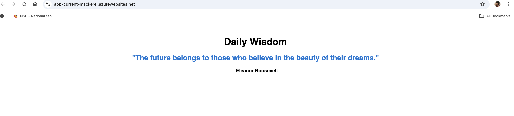
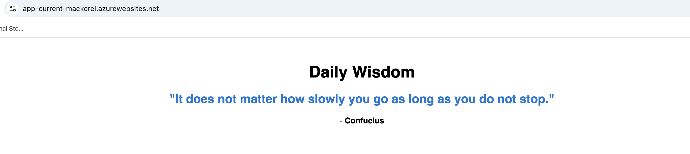

# Daily Wisdom - Azure DevOps Challenge





## Overview
A High-Availability web application deployed on Azure using Terraform. The app retrieves random quotes from an Azure SQL Database.

## Architecture
* **App Service:** Hosted on Azure Web Apps (Linux/Python).
* **Database:** Azure SQL Database (Standard S0 Tier).
* **Security:**
    * **Key Vault:** Stores sensitive SQL credentials.
    * **Managed Identity:** System-Assigned identity for secure vault access.
    * **Encryption:** Data at rest encrypted via Transparent Data Encryption (TDE).

## Infrastructure Decisions (Critical)
**Constraint:** The available Azure Free Trial subscription enforced a strict **0 vCPU quota** for Standard/Basic App Service Plans, preventing a standard production deployment.

**Solution:** To deliver a functional solution within these constraints, I adapted the Terraform configuration to:
1.  Use the **F1 (Free Tier)** App Service Plan.
2.  Deploy to the **Central US** region.
3.  Utilize **SQL Authentication** via Key Vault injection to ensure reliable connectivity given the networking limitations of the Free Tier.

---

## 🔒 Security & PII Compliance Report

The requirement was to treat the data as **Critical PII**. Below is the breakdown of the security measures implemented versus the limitations of the Free Tier environment.

### ✅ What is Implemented (PII Secure)
1.  **Identity Isolation:** No credentials are hardcoded. The Application uses a **Managed Identity** to retrieve secrets.
2.  **Secret Management:** The Database connection string is stored in **Azure Key Vault** with strict Access Policies (Least Privilege).
3.  **Encryption at Rest:** The Azure SQL Database uses **Transparent Data Encryption (TDE)** by default, protecting the physical data files.

### ⚠️ Free Tier Limitation (Network Isolation)
**The Constraint:**
The **F1 Free Tier** App Service does not support **VNet Integration**. This means the Web App cannot communicate with the Database over a private internal network.

**The Impact:**
To allow the connection, I was required to set the SQL Firewall rule to `0.0.0.0` ("Allow Azure Services"). While the database is still protected by strong authentication, **it listens on a Public Endpoint**, which is not sufficient for highly sensitive PII in a production banking/healthcare environment.

### 🚀 Production Roadmap (The PII Fix)
In a real production environment with a standard subscription, I would implement **Full Network Isolation** to meet strict PII compliance:

1.  **Upgrade Compute:** Move App Service to **Standard (S1)** or Premium to enable **VNet Integration**.
2.  **Private Link:** Deploy a **Private Endpoint** for the Azure SQL Database.
3.  **Disable Public Access:** Set `public_network_access_enabled = false` on the SQL Server.
    * *Result:* The database becomes invisible to the internet and is only accessible via the private internal IP address from the App Service.

---

## How to Deploy

**1. Infrastructure**
```bash
cd terraform
terraform init
terraform apply
# Note the Output URL and App Name
